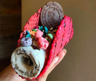
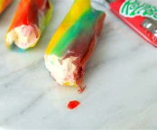
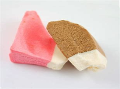

# IceCream_Proj
 ## Description of the task:
 >This task is about my online Ice cream pallar.
> I used bootstrap to design my webpage. Where
> I added 10 items where people can order some.
>There is also a form where you can fill in your details.

## How to install my project:
1. Go to my reseptory
2. Copy my reseptory url
3. Go to command prompt and add it the folder to your local reseptory

## Images:
* 
* 
* 
* 
* 
* 
* 
* 
* 
* 
* 
